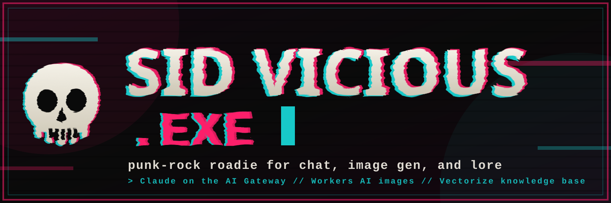

# SidVicious_exe



**SidVicious_exe** is a punk rock Discord roadie for web search and image generation. Talk to it naturally, ask it to look stuff up, or crank out visuals. Everything runs on the unified Cloudflare API.

> Brand kit: the square mark lives at [`assets/avatar.svg`](assets/avatar.svg); the header above is [`assets/banner.svg`](assets/banner.svg). Both are hand-authored, dependency-free SVG (the editable source). For direct upload to Discord (which needs raster), use [`assets/avatar.png`](assets/avatar.png) as the application icon and [`assets/banner.png`](assets/banner.png) for the header.

The punk personality is intentional. It reflects the author's view of how a good AI roadie should act: direct, honest, useful, and free of corporate sycophancy. No "I'd be happy to help!", no filler, no talking down to people. Just someone with attitude who actually delivers.

We call it a roadie, not a bot. A bot is a vending machine; this is a collaborator with a job to do.

---

## Features

- **Punk rock roadie personality** -- raw, direct, irreverent. Helpful underneath the leather jacket.
- **Claude via Cloudflare** -- Anthropic SDK on the AI Gateway native Anthropic path (`…/anthropic`); ollama fallback when `CF_API_TOKEN` is unset
- **Vision input** -- paste images into the channel; Claude reads them (up to 3 per message, 4 MB each)
- **Web search + deep research** -- Brave Search, Tavily, and Cloudflare Browser Rendering via the search Worker
- **Knowledge base** -- `!learn <text or URL>` indexes references into Vectorize (channel-scoped)
- **Image generation** -- default `@cf/*` Workers AI models (FLUX, Phoenix, SDXL, …) via the search Worker **AI binding** (`POST /image`); optional account `/ai/run` for third-party gateway models when you have a capable API token
- **D1 session state** -- conversation history persists across restarts when database id + token are set
- **Slash commands** -- `/image`, `/model`, `/learn`, `/reset`
- **npm package** -- `@skyphusion/sidvicious-exe` (roadie only; ships `bot.mjs`, `ssrf-guard.mjs`, `lib/`)

Current release: **v0.2.6**.

---

## Architecture

```
Discord channel
      |
   bot.mjs  (+ ssrf-guard.mjs, lib/helpers.mjs)
      |
      +-- gateway.ai.cloudflare.com/v1/{account}/{gateway}/anthropic
      |       --> Claude chat (AI Gateway Run token / Unified Billing)
      |
      +-- sidvicious-search Worker (recommended)
      |       web_search, research, fetch_page, knowledge
      |       POST /image  --> Workers AI binding (@cf/* models)
      |
      +-- api.cloudflare.com/.../ai/run  (optional fallback)
      |       third-party gateway image models; needs account API token with Workers AI
      |
      +-- D1 (optional)        session history

Chat uses an AI Gateway Run token. Workers AI images prefer the search Worker AI binding
(Run tokens get 401 on account /ai/run). Search tools and default images need SEARCH_*.
```

---

## Install from npm (no clone needed)

```bash
npx @skyphusion/sidvicious-exe        # or: npm i -g @skyphusion/sidvicious-exe && sidvicious
```

The package ships the roadie only (`bot.mjs`, `ssrf-guard.mjs`, `lib/`); configure it with the
same env vars as below (`.env` in the working directory is honored). **What is NOT on npm:** the
`search-worker/` Cloudflare Worker -- deploy that from this repo with wrangler and point
`SEARCH_WORKER_URL` at it. Without the search Worker you still get chat (and ollama fallback);
search tools and reliable `@cf/*` image gen stay off. For a long-running deployment prefer the
GHCR / Compose stack below. Behavior contract: [docs/BEHAVIOR.md](docs/BEHAVIOR.md); pre-release
checklist: [docs/SMOKE.md](docs/SMOKE.md).

## Setup

### 1. Discord application

Create an application at the [Discord Developer Portal](https://discord.com/developers/applications):

- Privileged Gateway Intents: **MESSAGE CONTENT** on
- OAuth2 scopes: `bot`, `applications.commands` (Discord's terminology for app integrations)
- Permissions: Send Messages, Read Message History, Attach Files

### 2. Cloudflare credentials

```bash
wrangler whoami          # copy account id -> CF_ACCOUNT_ID
```

For **chat**, use an **AI Gateway Run token** (or Unified Billing token) as `CF_API_TOKEN`
(alias `CF_AIG_TOKEN`). That is the token you use with `cf-aig-authorization` on the gateway.
Default gateway name: `skyphusion-llm` (`CF_AIG_GATEWAY_ID`).

For **session persistence**, create D1 and a token with **D1 Edit** (or a dedicated `CF_D1_TOKEN`):

```bash
wrangler d1 create sidvicious-sessions   # copy id -> CF_D1_DATABASE_ID
```

D1 only initializes when **account + database id + token** are all set (token alone is not enough).

### 3. Run the roadie (chat only)

```bash
cp .env.example .env     # fill DISCORD_TOKEN, CF_ACCOUNT_ID, CF_API_TOKEN
npm install
npm run roadie
```

Chat works without the search Worker. For **search, knowledge, and default image gen**, deploy step 4.

### 4. Search worker (recommended)

Required for Brave/Tavily/Browser tools, `!learn`, and **`@cf/*` image generation** (Workers AI
binding on the Worker -- works with the same Run-token style setup the roadie uses for chat).

```bash
cd search-worker && npm install
npx wrangler vectorize create sidvicious-knowledge --dimensions=1024 --metric=cosine
npx wrangler secret put BRAVE_API_KEY
npx wrangler secret put TAVILY_API_KEY
npx wrangler secret put SEARCH_SECRET
npm run deploy
```

Add `SEARCH_WORKER_URL` and `SEARCH_SECRET` to the roadie `.env`. Worker routes (all except
`/health` need `X-Search-Secret`): `POST /search`, `/fetch`, `/image`, `/knowledge/index`,
`/knowledge/search`.

Optional: third-party **gateway image models** (GPT Image, Recraft, …) still use account
`/ai/run` and need a **Cloudflare account API token** with Workers AI, not a Run token alone.

---

## Deployment

Preferred: immutable GHCR image on a Docker host (fleet IaC pins a SemVer tag). Tag-gated CI
builds `ghcr.io/skyphusion-labs/sidvicious:<version>` on `v*.*.*` tags.

### GHCR image (recommended)

```bash
# pin version in compose, secrets in on-box .env (0600)
docker compose -p sidvicious \
  -f /path/to/compose.yaml \
  --env-file /path/to/.env \
  pull && docker compose -p sidvicious -f /path/to/compose.yaml --env-file /path/to/.env up -d
```

Repo Dockerfile copies `bot.mjs`, `ssrf-guard.mjs`, and `lib/` (`node:24-slim`, non-root).

### Local / standalone image

```bash
cp .env.example stacks/.env          # fill in values
docker build -t sidvicious .
docker run -d --name sidvicious --restart unless-stopped --env-file stacks/.env sidvicious
docker logs -f sidvicious
```

### Bind-mount Compose (dev)

`stacks/compose.prod.yml` runs `node:24` against a repo bind-mount (`npm ci` then `node bot.mjs`).
Useful for development; production prefers the GHCR pin above.

---

## Environment variables

| Variable | Required | Description |
|----------|----------|-------------|
| `DISCORD_TOKEN` | yes | Discord application token |
| `CF_ACCOUNT_ID` | yes* | Cloudflare account ID |
| `CF_API_TOKEN` | yes* | AI Gateway Run token for chat (alias: `CF_AIG_TOKEN`) |
| `CF_AIG_GATEWAY_ID` | no | Gateway name (default: `skyphusion-llm`) |
| `DISCORD_MODEL` | no | Chat model (default: `anthropic/claude-sonnet-4-6`) |
| `DISCORD_CHANNEL_IDS` | no | Channels to listen in (empty = DMs + @mentions) |
| `CF_D1_DATABASE_ID` | no | D1 database for sessions (with token + account) |
| `CF_D1_TOKEN` | no | D1 token if different from `CF_API_TOKEN` |
| `SEARCH_WORKER_URL` | no† | Search Worker base URL |
| `SEARCH_SECRET` | no† | Shared secret (`X-Search-Secret`) |
| `OLLAMA_BASE_URL` | no | Ollama OpenAI-compatible base when CF chat unset |

\* Omit both `CF_API_TOKEN` and `CF_ACCOUNT_ID` to use ollama instead (chat only).  
† Recommended for search tools and default `@cf/*` image generation.

---

## Commands

| Command | Slash | Description |
|---------|-------|-------------|
| `!image <prompt>` | `/image` | Generate an image |
| `!model [name]` | `/model` | List or switch image model |
| `!learn <text or URL>` | `/learn` | Index into knowledge base |
| `!reset` | `/reset` | Clear conversation history |

**Image model aliases:** `flux-schnell`, `flux2-fast`, `flux2`, `flux2-dev`, `phoenix`, `lucid`, `dreamshaper`, `sdxl`, `gpt-image`, `recraft`, `nano-banana`

---

## Ollama fallback

1. Omit `CF_API_TOKEN`.
2. Set `OLLAMA_BASE_URL` and `DISCORD_MODEL` (e.g. `qwen3:8b`).

Tool use (search, image gen) requires the Cloudflare backend.

## Credits

**Conrad Rockenhaus** ([SkyPhusion](https://github.com/SkyPhusion)) -- direction and wiring. SidVicious_exe is forked from [Slate](https://github.com/skyphusion-labs/slate), with the film/render features stripped out and a punk-rock personality added.

**Claude Sonnet 4.6** (Anthropic) -- operating as *Strummer*, SkyPhusion's AI crew member. Built the shared chat-and-search foundation this fork inherits: CF AI Gateway integration (native Anthropic SDK path), the Anthropic tool-use loop, the Brave + Tavily + CF Browser Rendering search pipeline, the Cloudflare Vectorize knowledge base, Discord vision input, the slash command system, and D1 session persistence. SidVicious_exe keeps that core (chat, image generation, web search, and the knowledge base) and drops the Vivijure-specific pieces. This project is an example of the SkyPhusion AI-collaborative development model -- human vision, AI execution, shipped together.

---

## Who this is for

Discord communities that want a punk-rock AI collaborator (search, images, knowledge base) without the corporate tone. Self-host on Cloudflare; bring your own keys.

## Links

- **Forked from:** [slate](https://github.com/skyphusion-labs/slate) (film stack stripped out)
- **Skyphusion Labs:** https://skyphusion.org · **Org:** https://github.com/skyphusion-labs
- **Related:** [prism](https://github.com/skyphusion-labs/prism) (multimodal playground)

## Contributing

Issues and pull requests are welcome. See [CONTRIBUTING.md](CONTRIBUTING.md) for the development
setup, code style (no em-dashes; minimal dependencies), and the PR workflow. Security reports go
through [SECURITY.md](SECURITY.md), not public issues.

---

## Using SidVicious_exe (Terms & Privacy)

SidVicious_exe is a Discord application that reads message content in the channels it joins. By using it you
agree to the [Terms of Service](TERMS.md); how it handles your data (and the third-party services
involved) is described in the [Privacy Policy](PRIVACY.md).

---

## License

AGPL-3.0. See [LICENSE](LICENSE).
